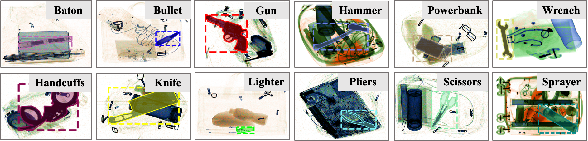
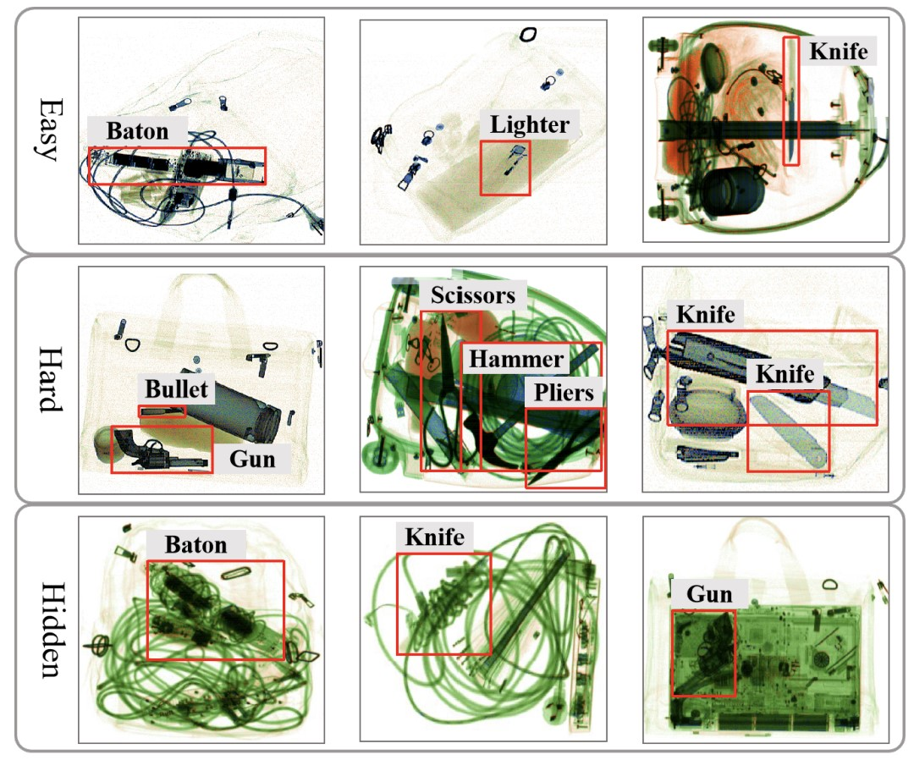
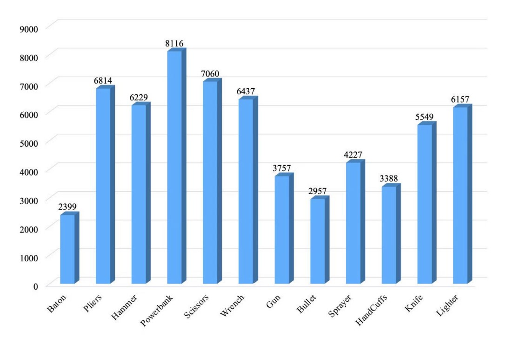
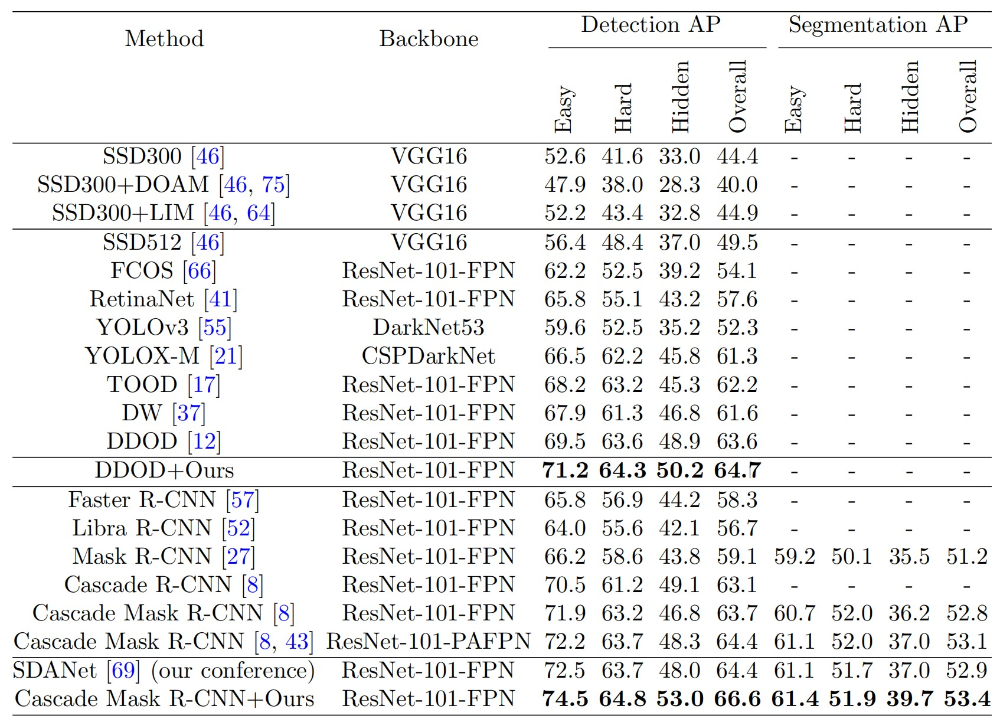
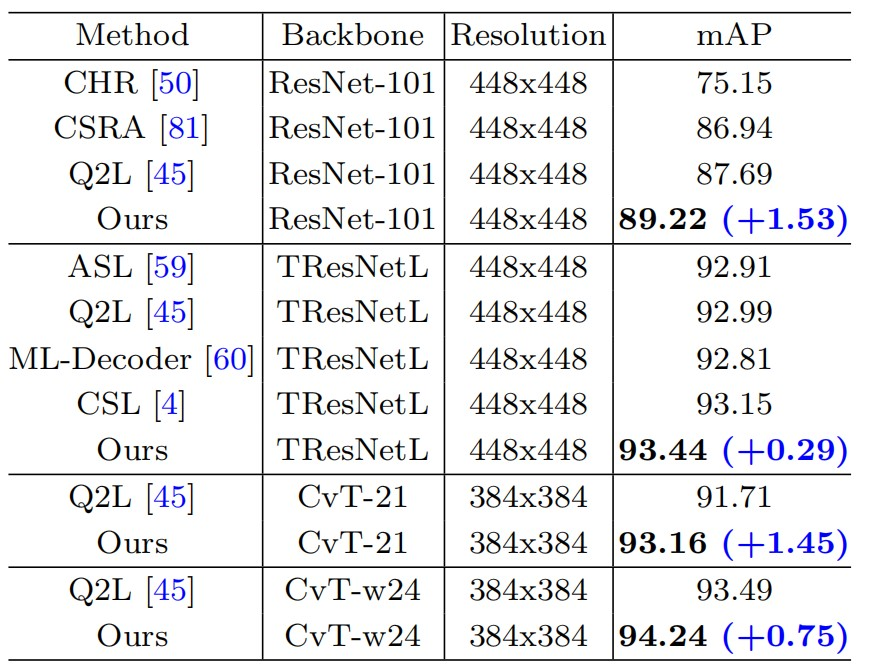

#  PIDray: A Large-scale X-ray Benchmark for Real-World Prohibited Item Detection 

## Abstract

 Automatic security inspection relying on computer vision technology is a challenging task in realworld scenarios due to many factors, such as intra-class variance, class imbalance, and occlusion. Most previous methods rarely touch the cases where the prohibited items are deliberately hidden in messy objects because of the scarcity of large-scale datasets, hindering their applications. To address this issue and facilitate related research, we present a large-scale dataset, named PIDray, which covers various cases in real-world scenarios for prohibited item detection, especially for deliberately hidden items. In specific, PIDray collects 124, 486 X-ray images for 12 categories of prohibited items, and each image is manually annotated with careful inspection, which makes it, to our best knowledge, to largest prohibited items detection dataset to date. Meanwhile, we propose a general divide-andconquer pipeline to develop baseline algorithms on PIDray. Specifically, we adopt the tree-like structure to suppress the influence of the long-tailed issue in the PIDray dataset, where the first course-grained node is tasked with the binary classification to alleviate the influence of head category, while the subsequent fine-grained node is dedicated to the specific tasks of the tail categories. Based on this simple yet effective scheme, we offer strong task-specific baselines across object detection, instance segmentation, and multi-label classification tasks and verify the generalization ability on common datasets (e.g., COCO and PASCAL VOC). Extensive experiments on PIDray demonstrate that the proposed method performs favorably against current state-of-the-art methods, especially for deliberately hidden items. 


## Dataset

### Sample






### Statistics

<table>
<thead>
  <tr>
    <th rowspan="2" style="text-align: center;">Mode</th>
    <th rowspan="2" style="text-align: center;">Train</th>
    <th colspan="3" style="text-align: center;">Test</th>
  </tr>
  <tr>
    <th style="text-align: center;">Easy</th>
    <th style="text-align: center;">Hard</th>
    <th style="text-align: center;">Hidden</th>
  </tr>
</thead>
<tbody>
  <tr>
    <td style="text-align: center;">Count</td>
    <td style="text-align: center;">76,913</td>
    <td style="text-align: center;">24,758</td>
    <td style="text-align: center;">9,746</td>
    <td style="text-align: center;">13,069</td>
  </tr>
  <tr>
    <td style="text-align: center;">Total</td>
    <td colspan="4" style="text-align: center;">124,486</td>
  </tr>
</tbody>
</table>




### Dataset Download

Google Drive: https://drive.google.com/drive/folders/1zvMIc1bqteRN9Z36hHYpoTGoZArsh4mE

Baidu Netdisk: https://pan.baidu.com/s/1qPUNWYItg08pht0kFn8qxg  code: 8vz6


### Model weights

Google Drive: https://drive.google.com/drive/folders/1zvMIc1bqteRN9Z36hHYpoTGoZArsh4mE

Baidu Netdisk: https://pan.baidu.com/s/1JHmMIIf_SoQ7o1HsneT_tg  code: brkx


## Our results on PIDray

### Object detection and instance segmentation




### Multi-label classification




## Installation

Our code is based on mmdetection V2.25. We recommend you to follow their instruction to build the environment. We also provide the *requirements.txt* of our environment.


## Reproduce Our Results

1. Change the data path in the director, *configs*.

2. Train the model use the command. We also provide our model_weights.

   ```bash
   CUDA_VISIBLE_DEVICES=0,1,2,3,4,5,6,7 sh ./tools/dist_train.sh ./configs/cascade_mask_rcnn_r101_with_R0R1.py 8
   
   ```

3. Test the model use the commad.

   ```bash
   CUDA_VISIBLE_DEVICES=0,1,2,3,4,5,6,7 sh ./tools/dist_test.sh ./configs/cascade_mask_rcnn_r101_with_R0R1.py ./model_weights/cascade_mask_rcnn_r101_with_R0R1.pth 8 --out ./result.pkl --eval bbox segm
   ```


## Acknowledgments

We sincerely thank [mmdetection](https://github.com/open-mmlab/mmdetection) for being open source.  We also greatly thank the anounymous reviewers for the constructive comments to help us improve the paper.